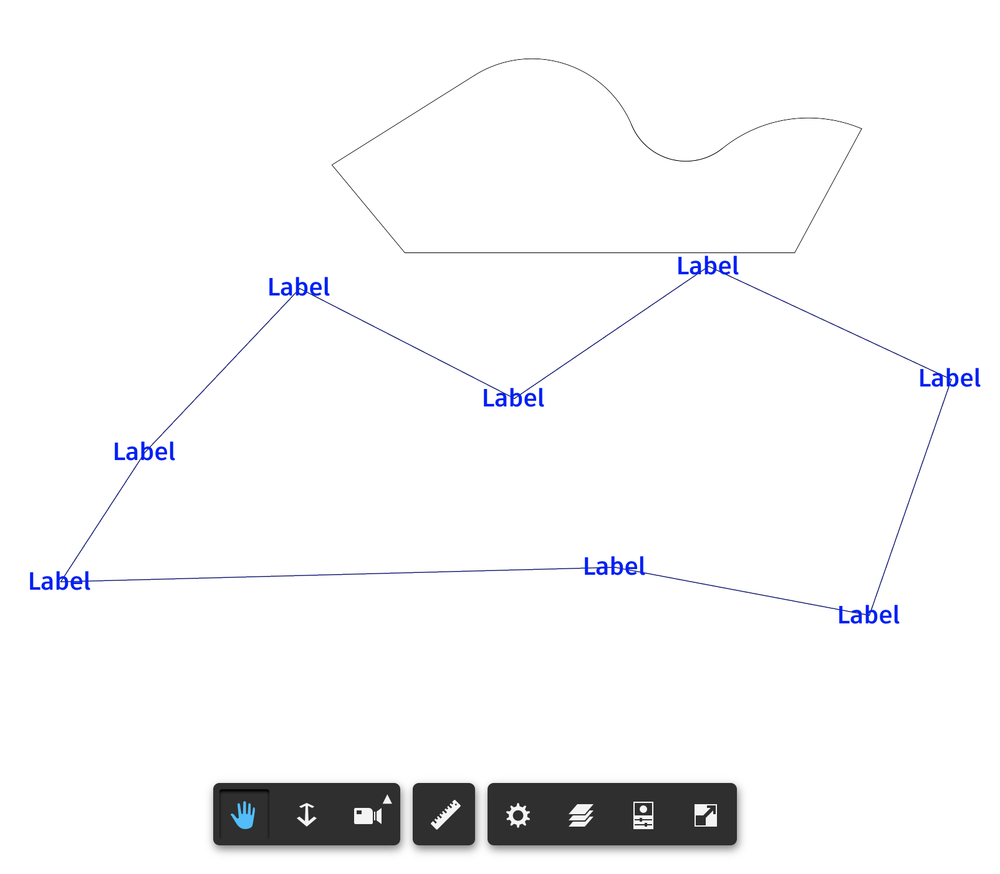
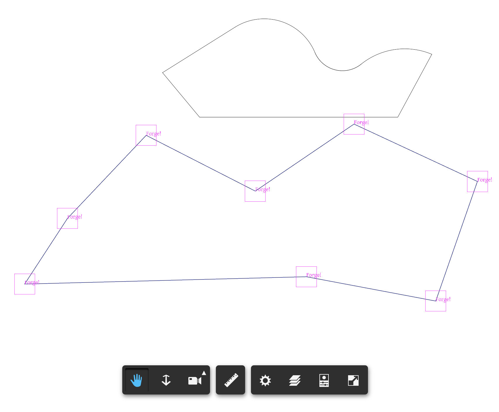

# Forge-Viewer-Icon-2D-Sheet


## Thubmnail


## Description

This repository demos the ways to attach label to the polyline vertex of the 2D drawing. It is based on https://github.com/Autodesk-Forge/learn.forge.viewmodels/tree/nodejs, please follow that readme to setup the project and prepare testing drawing. In this sample, provide some 2D sheets.

  


## Steps

1. Clone this repository 
2. Type the command line script to install packages
```
   npm install
```
3. Input your Forge client id and secret to [launch.json](./.vscode/launch.json)

4. Start to debug

5. In the browser, follow the steps to test

   ###  Way 1: by HTML Label

   - input http://localhost:3000/index-by-label.html
   - select one drawing in the bucket.
   - After it is loaded, open console of browser, type function **add2DLabel_By_HTMLElement()**
   - Select one polyline in the screen. The label will be created on the vertex
   - Pan the drawing to see the labels moving together
<p align="center"></p>


   ### Way 1: by Three.js Element

   - input http://localhost:3000/index-by-three.html
   - select one drawing in the bucket.
   - After it is loaded, open console of browser, type function **add2DLabel_By_ThreeJS()**
   - Select one polyline in the screen. The label will be created on the vertex
   - Pan the drawing to see the labels moving together

<p align="center"></p>

## Pending Investigations

1. The primitives of some arc/line of polyline are tiny line segments. So no idea how to get the end points of the polyline segment. Will need to check with engineer team
2. If by Three.js TextGeometry, tricky to set position, font size and thickness. Right now, set position and scale after the mesh is created. Will check the best way.
3. Only line segments are attached with label in this version. The developer can add similar codes for the segments if it is CircularArc or EllipticalArc. 

